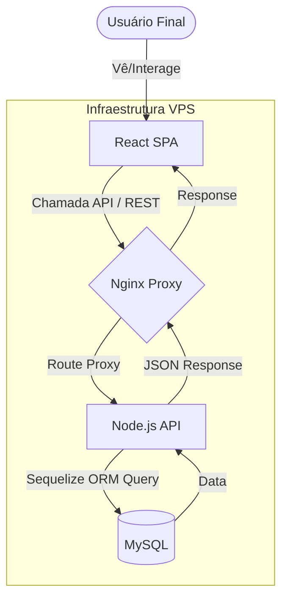
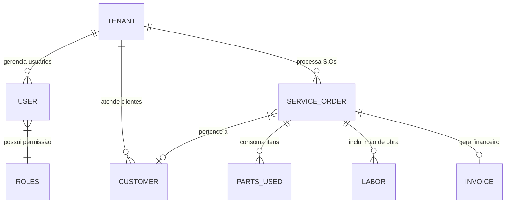
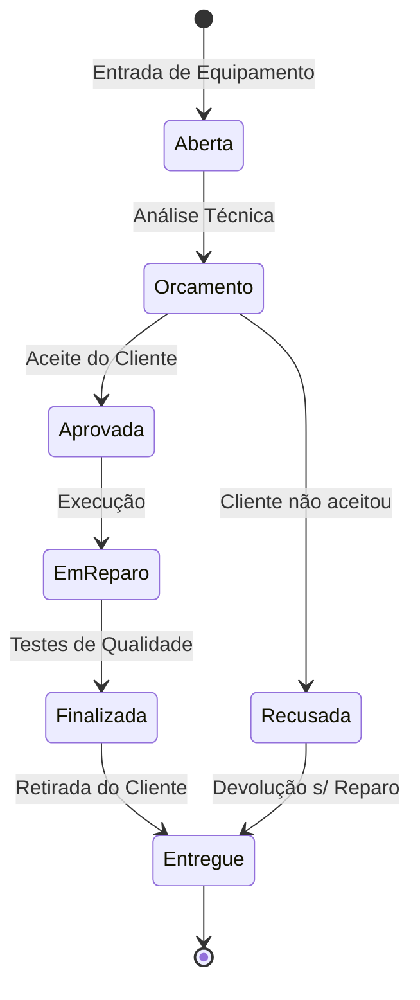

# 📊 Diagramas do Sistema: Electrocode OS

Este documento apresenta a visualização técnica dos fluxos e estruturas que compõem o ecossistema do **Electrocode OS**.

---

## 1. Fluxo de Requisição (Request Pipeline)

O diagrama abaixo ilustra como as requisições dos usuários são processadas, desde a interface frontend até a persistência no banco de dados, através da camada de proxy reverso.

---

## 2. Modelo de Dados Simplificado (ER Diagram)

A estrutura relacional foi projetada para suportar alta granularidade de permissões e rastreabilidade total de cada item físico ou financeiro.

---

## 3. Fluxo de Ciclo de Vida da O.S. (Workflow)

O fluxo de negócio implementado permite o controle rígido do status de cada equipamento em manutenção.

---

### Notas Técnicas:
1. **Segurança**: Todas as comunicações entre Nginx, Backend e Frontend são protegidas por criptografia SSL/TLS em ambientes de produção.
2. **Separação de Dados**: O sistema utiliza o conceito de Multi-Tenancy (baseado em IDs de empresa), garantindo que dados de diferentes empresas jamais se cruzem.
3. **Escalabilidade**: Os componentes dentro da VPS podem ser distribuídos para múltiplos nós caso a carga de usuários aumente excessivamente.

**Erasmo Cardoso**
Analista Desenvolvedor de Sistemas | Electrocode
