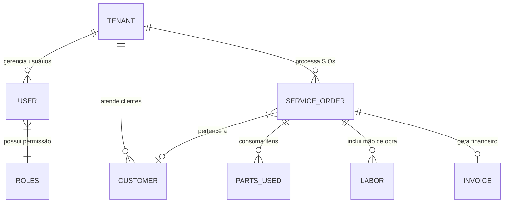
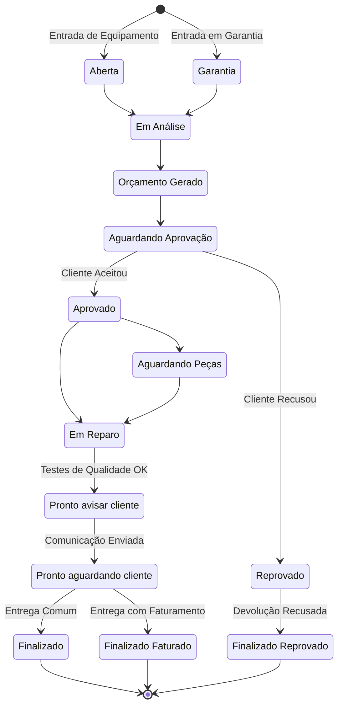
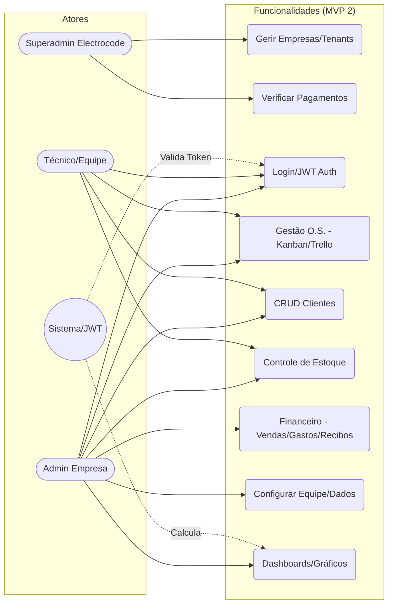

# Diagramas do Sistema: Electrocode OS

Visualização técnica de fluxos e estruturas do **Electrocode OS**.

---

## 1. Fluxo de Requisição (Request Pipeline)

Processamento de requisições do frontend até a persistência via proxy reverso.

---

## 2. Modelo de Dados Simplificado (ER Diagram)

Estrutura relacional para suporte a multi-tenancy e rastreabilidade.

---

## 3. Fluxo de Ciclo de Vida da O.S. (Workflow)

Controle de status do ciclo de vida das ordens de serviço.

---

## 4. Diagrama de Casos de Uso (MVP 2 - RBAC & Funcionalidades)

Representação das interações entre os atores do sistema e as funcionalidades de gestão Core e Multitenant.

---

 **Erasmo Cardoso**
Electrocode

